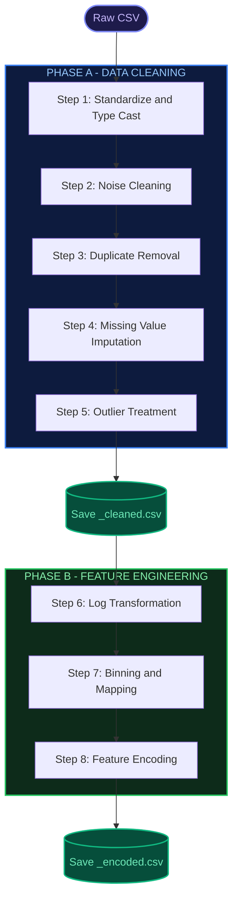

# Preprocessing Pipeline — System Design Document

## Overview

The **Preprocessing Pipeline** is a fixed 8-step automated data cleaning and transformation pipeline implemented in the Employee Analytics System. It processes raw CSV data through two phases:

- **Phase A (Data Cleaning — Steps 1–5):** Output saved as `<filename>_cleaned.csv`
- **Phase B (Feature Engineering — Steps 6–8):** Output saved as `<filename>_encoded.csv`

---

## Step 1 — Standardize & Type Cast

| Attribute | Detail |
|-----------|--------|
| **Purpose** | Normalize text formatting and correct mistyped columns |
| **Scope** | All categorical columns |

### Processing Phases

**Phase 1 — Whitespace Trimming**
Strips leading and trailing whitespace from all non-null values in categorical columns. Operates only on non-null rows to avoid casting NaN to string.

**Phase 2 — Case Normalization**
Groups unique values by their lowercased form, then replaces minority variants with the most-frequent surface form (canonical variant). Example: `"male"` → `"Male"` if `"Male"` appears more often.

- Builds a frequency table — O(N)
- Groups by lowercase to detect mixed-case variants
- Maps each minority variant to the canonical (most-frequent) form

**Phase 3 — Auto Dtype Conversion**
Detects categorical columns that actually contain numeric data and casts them to integer or float.

- Conversion threshold: ≥ 90% of non-null values must be valid numbers
- If all valid values are integers → `int64`, else → `float64`

---

## Step 2 — Noise Cleaning

| Attribute | Detail |
|-----------|--------|
| **Purpose** | Replace noise / placeholder tokens with NaN for downstream imputation |
| **Strategy** | Replace with NaN (default) |
| **Scope** | Categorical columns only |

### Noise Detection

A value is classified as noise if it matches one of these patterns:

- **Symbol-only tokens:** `?`, `-`, `.`, `!`, `#`, `*` (single or repeated)
- **Placeholder keywords (case-insensitive):** [na](file:///d:/Cranes_FPT/projects/employee_data_analysis/modules/ui/components.py#431-593), `n/a`, `none`, `null`, `undefined`, `unknown`, [missing](file:///d:/Cranes_FPT/projects/employee_data_analysis/modules/core/report_engine.py#120-161)

### Processing Flow

For each categorical column:
1. Extract non-null values as strings
2. Apply noise detection pattern matching
3. Replace all matched noise values with NaN
4. These NaN cells flow into Step 4 (Missing Value Imputation)

### Metric Tracked

**Noise Cleaned** = total new NaN cells introduced (NaN count after − NaN count before)

---

## Step 3 — Duplicate Removal

| Attribute | Detail |
|-----------|--------|
| **Purpose** | Remove fully-duplicate rows |
| **Keep Strategy** | First occurrence retained |
| **Algorithm** | Hash-based deduplication (pandas native) |

### Metric Tracked

**Duplicates Dropped** = row count before − row count after

---

## Step 4 — Missing Value Imputation

| Attribute | Detail |
|-----------|--------|
| **Purpose** | Auto-fill all remaining NaN values based on column type and distribution shape |

### Imputation Rules

| Column Type | Condition | Strategy | Formula |
|-------------|-----------|----------|---------|
| **Numeric** | \|skewness\| < 0.5 (near-normal) | **Mean** | x̄ = (1/n) × Σxᵢ |
| **Numeric** | \|skewness\| ≥ 0.5 (skewed) | **Median** | Middle value of sorted data |
| **Numeric** | < 3 non-null values | **Median** | Fallback (insufficient data for skewness) |
| **Categorical** | Always | **Mode** | Most frequent value |

### Skewness Formula (Fisher's Definition)

`g₁ = m₃ / m₂^(3/2)`

Where:
- `m₃ = (1/n) × Σ(xᵢ - x̄)³` — third central moment
- `m₂ = (1/n) × Σ(xᵢ - x̄)²` — second central moment (variance)

---

## Step 5 — Outlier Treatment

| Attribute | Detail |
|-----------|--------|
| **Purpose** | Cap statistical outliers per-column using auto-selected methods |
| **Safe Zone** | Admin-configured value ranges that protect domain-valid outliers |

### Auto Method Selection (based on skewness)

| Skewness (\|s\|) | Detection Method | Treatment | Default Threshold |
|-------------------|------------------|-----------|-------------------|
| < 0.5 | **Z-Score** | Capping | k = 3.0 |
| 0.5 – 1.0 | **IQR** | Capping | k = 1.5 |
| > 1.0 | **Modified Z-Score** | Capping | k = 3.5 |

### Detection Formulas

**Z-Score:** Flag values where `|z| > k`, with `z = (x - μ) / σ`

**IQR:** Flag values outside `[Q₁ - k × IQR, Q₃ + k × IQR]` where `IQR = Q₃ - Q₁`

**Modified Z-Score (MAD-based):** Flag values where `|Mᵢ| > k`, with `Mᵢ = (xᵢ - median) / (MAD / 0.6745)`

### Safe Zone Priority

1. Values **inside** the Admin Safe Zone → **never treated** (protected)
2. Values **outside** Safe Zone AND statistical outliers → **clipped to Safe Zone bounds**
3. No Safe Zone configured → **clipped to statistical fence**

### Output Checkpoint

After Step 5, the cleaned DataFrame is **snapshot-copied** and saved as `_cleaned.csv`. This is the primary output for data quality analysis.

---

## Step 6 — Log Transformation

| Attribute | Detail |
|-----------|--------|
| **Purpose** | Reduce right-skewness in numeric columns for better model performance |
| **Trigger** | Columns with \|skewness\| > 1.0 |

### Method Selection

| Condition | Method | Formula |
|-----------|--------|---------|
| All values ≥ 0 | **log1p** | `x' = ln(1 + x)` |
| Contains negative values | **Yeo-Johnson** | Power transform (handles negatives) |

### Processing Logic

1. Identify candidate columns where \|skewness\| exceeds threshold
2. For each candidate:
   - **log1p** — safe for values ≥ 0, preserves zeros
   - **Yeo-Johnson** — used when column contains negative values, does not standardize output
3. Transformed values replace originals in-place

---

## Step 7 — Binning & Mapping

| Attribute | Detail |
|-----------|--------|
| **Purpose** | Discretize continuous features and consolidate high-cardinality categories |
| **Configuration** | Admin-configurable rules per column |

### Numeric Binning

Continuous numeric columns are discretized into labeled bins:

| Column | Bins | Labels |
|--------|------|--------|
| Age | [0, 25, 35, 50, 65, 120] | ≤25, 26-35, 36-50, 51-65, >65 |
| Hours_per_Week | [0, 20, 39, 40, 60, 168] | ≤20, 21-39, 40, 41-60, >60 |

### Category Mapping

High-cardinality categorical columns are consolidated into semantic groups. Unmapped values are preserved as-is.

| Column | Groups |
|--------|--------|
| Education | Basic, HS-grad, Some/Assoc, Bachelors, Advanced |
| Workclass | Public, Private, Self-employed, Others |
| Marital_Status | Married, Never-married, Previously-married, Spouse-absent |
| Occupation | Management/Professional, Service, Blue-collar, Admin/Sales, Other |

---

## Step 8 — Feature Encoding

| Attribute | Detail |
|-----------|--------|
| **Purpose** | Convert all remaining categorical features to numeric representation |

### Encoding Strategy (by priority)

| Priority | Rule | Encoding | Example |
|----------|------|----------|---------|
| 1 | Column has a numeric counterpart already in dataset | **Drop (Redundant)** | Education dropped when Education_Num exists |
| 2 | Binary column (≤ 2 unique values) | **Label Encoding** | Sex → {0, 1} |
| 3 | Ordinal column (natural order exists) | **Label Encoding** | Age (binned) → {0, 1, 2, 3, 4} |
| 4 | Nominal column (no natural order) | **One-Hot Encoding** (drop first) | Race → Race_Black, Race_White, … |

### Key Details

- **Label Encoding**: Maps categories to integer codes, preserving ordinal relationships. Unknown values assigned code -1.
- **One-Hot Encoding**: Expands into binary indicator columns, drops first category to avoid multicollinearity.
- Columns created by Step 7 binning are automatically converted from categorical to string type before encoding.

### Output

After Step 8, the fully-encoded DataFrame is saved as `_encoded.csv`. All columns are numeric, ready for machine learning model consumption.

---

## Quality Metrics — Before vs After

After pipeline completion, a comparison table is generated from the Step 5 cleaned data:

| Metric | Before | After |
|--------|--------|-------|
| Missing Values | Total NaN + noise count (raw data) | Re-computed from cleaned data |
| Noise Values | Count of noise tokens replaced | Re-verified via pattern matching on cleaned data |
| Duplicate Rows | Count before dedup | Re-computed from cleaned data |
| Outliers | Sum of per-column outlier detection | Re-computed from cleaned data |

> [!IMPORTANT]
> All "after" values are **computed from actual data** — never hardcoded. This ensures the comparison table reflects true data quality improvements.
